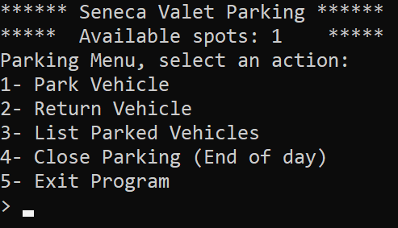
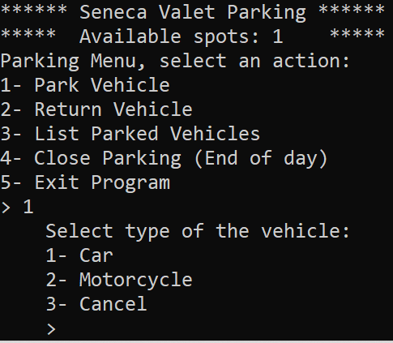

# About the Project
This valet parking application allows you to park and return a vehicle (car and motorcycle), list parked vehicles and close parking at the end of day.

## Main menu will be shown when you start the application

## Park a vehicle

## Enter your vehicle's information

## Return a vehicle

## Closing parking

# Built with
* C++

# Getting Started
* Compilation
  - g++ ./*.cpp
  
* Run the application
  - ./a.out
  
# Installation
Download and extract a zip file.

